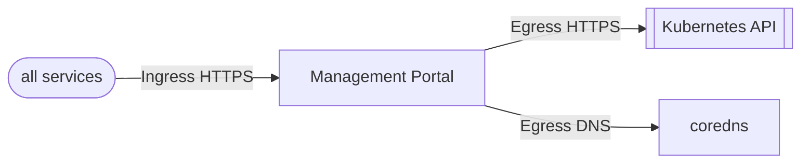

The FluxCD Configuration for the analytics workspace management solution.

This will create a helm release targeted at the [helm chart for the Analytics Workspace Management Solution](../../../helm/analytics-workspace-management/docs/chart.md)

## Network Policies

| Direction | Ports/Type | Description |
| --- | --- | --- |
| Ingress | All | Allows all traffic inbound. TODO: This needs to be refined |
| Egress | TCP/UDP 53 | Allows traffic for DNS ports |
| Egress | HTTPS | Allows access to the kubernetes service to allow Kubernetes API Access |